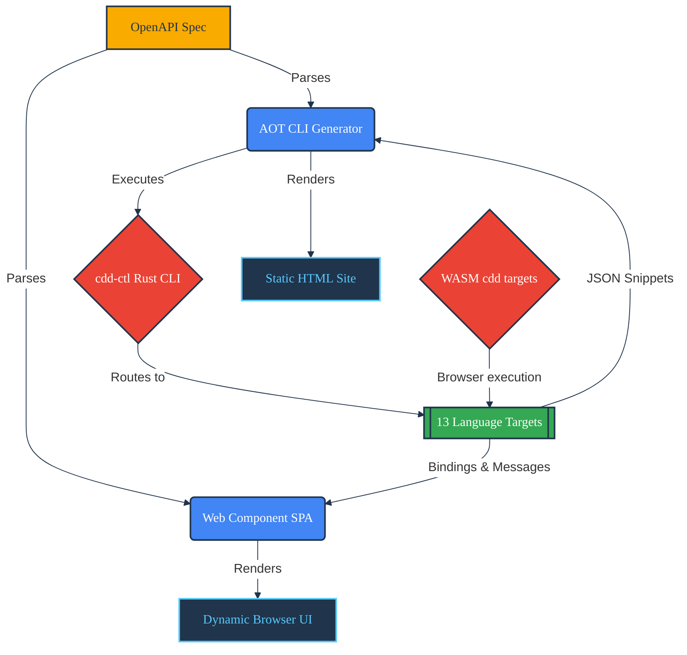

# CDD Docs UI Architecture

 

This document describes the high-level architecture of `cdd-docs-ui`, a dual-mode documentation tool that parses OpenAPI specifications and generates either a purely static, server-side rendered (SSR) API documentation website, or acts as a client-side Custom Web Component Single Page Application (SPA).

## Architecture Diagram

## Core Concepts

1. **Static Site Generation (AOT Mode) with Graceful Degradation:**
   The CLI generates static HTML files. Every endpoint and language combination can have a dedicated structure. This ensures the documentation works perfectly without JavaScript enabled, is highly SEO-friendly, and loads instantaneously. It relies on pure TypeScript string literals and `marked` for HTML rendering, eschewing heavier template engines like EJS.

2. **Client-Side SPA (Web Component Mode):**
   The project exports a Custom Web Component (`<cdd-api-docs>`) that can be embedded in any frontend (like `cdd-web-ui`). It dynamically renders an OpenAPI spec in the browser. It integrates deeply via attribute and property bindings (e.g. `[sdkExamples]`, `spec-content`) to receive live generated snippets offline. It also supports legacy `postMessage` integration to sync states (like themes and real-time spec updates) with parent iframe containers.

3. **External Code Generation via `cdd-ctl` Toolchain:**
   In AOT mode, the tool shells out to the `cdd-ctl` Rust CLI tool. It passes the OpenAPI spec to this amalgamation tool and expects JSON payloads containing the generated code examples for a requested target language. The frontend UI is then self-contained with these snippets.
   *Note: In SPA mode, these snippets are generated entirely offline by the parent application (via WASM) and fed directly into the Web Component.*

## Component Breakdown

The application is built in TypeScript and consists of the following primary modules:

### 1. CLI Core (`src/cli.ts`)

Uses `commander` to parse command-line arguments. It acts as the entry point for the AOT mode, collecting the input specification path, output directory path, and passing control to the AOT Generator.

### 2. AOT Generator (`src/aot-generator.ts`)

The orchestrator of the Static Site Generation process.

- **Parsing:** Reads the OpenAPI `spec.json`.
- **Navigation Construction:** Parses the `paths` object in the OpenAPI spec to build a structured navigation tree (methods, paths, summaries).
- **Data Aggregation:** Calls the `runner` to execute the external CDD tools and collect code examples.
- **HTML Rendering:** Uses pure TypeScript string literals and `marked` to render the static HTML layouts. It iterates over the data to generate the final markup.
- **Asset Emission:** Writes the static assets to the output directory.

### 3. Runner (`src/runner.ts`)

Responsible for interacting with the operating system and external processes.

- **Process Execution:** Uses `child_process.exec` to run commands like `cdd-ctl python-all to_docs_json -i spec.json`.
- **Fallback Mocking:** If the `cdd-ctl` tool is not installed or fails, the runner gracefully degrades by generating mock text. This ensures the documentation UI can still be generated and tested even if the underlying code generator is unavailable.

### 4. Web Component SPA (`src/web-component.ts`)

The client-side entry point for the single-page application mode.

- **Custom Element:** Defines `<cdd-api-docs>`, a web component.
- **postMessage Listener:** Listens for `UPDATE_SPEC` and `SET_THEME` messages from a parent window to dynamically update the rendered documentation and apply light/dark styling.
- **Dynamic Rendering:** Parses the passed OpenAPI spec on the fly and updates the DOM without needing a Node.js backend.

### 5. Types (`src/types.ts` & `src/openapi-types.ts`)

Enforces strict TypeScript interfaces for all internal structures, including CLI options, OpenAPI Schema shapes (`OpenAPISpec`, `OpenAPIEndpoint`), and the expected output structures from the CDD tools.

## Data Flow (AOT CLI)

1. User executes `cdd-docs-cli -i spec.json -o build/`.
2. `cli.ts` parses the arguments.
3. `aot-generator.ts` reads `spec.json`.
4. `runner.ts` executes `cdd-ctl` tool target commands to generate code examples for all languages and variants.
5. Code examples are aggregated in memory.
6. `aot-generator.ts` renders the HTML pages using TS literals and writes them to the `build/` directory alongside `styles.css`.

## Data Flow (Web Component SPA)

1. A parent application (e.g., `cdd-web-ui`) imports the library and embeds `<cdd-api-docs></cdd-api-docs>`.
2. The parent application natively generates SDK examples offline using WASM targets for supported languages.
3. The component receives the spec and generated code snippets via modern web component bindings (`[attr.spec-content]`, `[sdkExamples]`). 
4. **(Legacy/Iframe mode):** The component initializes and posts a `DOCS_UI_READY` message to the parent window, and listens for `UPDATE_SPEC` messages with the OpenAPI string via `postMessage`.
5. The component parses the spec, merges the provided snippets, and dynamically renders the documentation layout directly in the browser.
