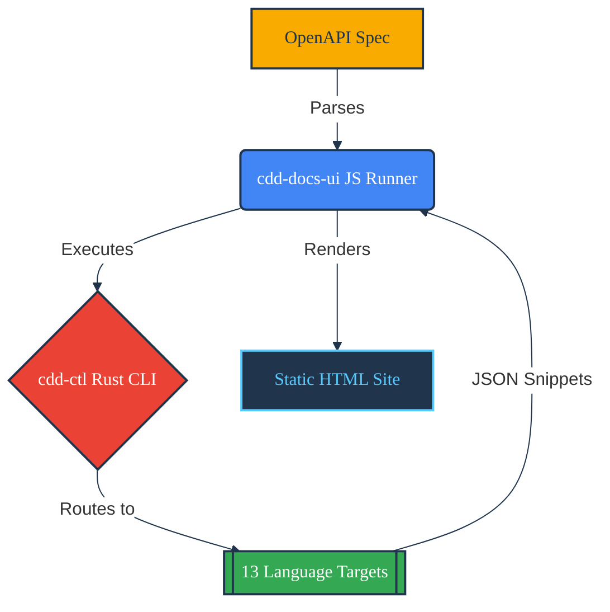

# Development Plan

 

## Amalgamation CLI Integration

The ad-hoc `cdd_*` binaries are being replaced with the centralized `cdd-ctl` Rust binary.

### Feature Delivery Checklist

#### 1. Core CLI Execution & Orchestration

- [ ] **Subprocess Invocation:** Implement `child_process.exec` securely in `cdd-docs-ui` to invoke `./cdd-ctl <lang> to_docs_json -i <spec>`.
- [ ] **Argument Passing:** Map `CLIOptions` (e.g., `--no-imports`, `--no-wrapping`) seamlessly to their respective `cdd-ctl` invocations.
- [ ] **Concurrent Execution:** Ensure `cdd-docs-ui` invokes multiple language targets and variants concurrently without thread blocking for faster generation.
- [ ] **Binary Resolution & Auto-fetching:** Add logic to detect if `cdd-ctl` exists locally, optionally downloading the correct pre-compiled release artifact or using a `CDD_CTL_PATH` environment variable override.

#### 2. Language Targets Integration (13 Supported)

Integrate and validate execution pipelines for all 13 targeted languages. Ensure the UI can request snippets for Client, Client CLI, and Server configurations across the specified OpenAPI standards.

- [ ] **C (C89)** ([`cdd-c`](https://github.com/SamuelMarks/cdd-c)):
    - Features: Client; Client CLI; Server; FFI.
    - OpenAPI: 3.2.0.
    - CI: 
- [ ] **C++** ([`cdd-cpp`](https://github.com/SamuelMarks/cdd-cpp)):
    - Features: Client; Client CLI; Server; Upgrades Swagger & Google Discovery to OpenAPI 3.2.0.
    - OpenAPI: Swagger 2.0 until OpenAPI 3.2.0.
    - CI: 
- [ ] **C#** ([`cdd-csharp`](https://github.com/SamuelMarks/cdd-csharp)):
    - Features: Client; Client CLI; Server; CLR.
    - OpenAPI: 3.2.0.
    - CI: 
- [ ] **Go** ([`cdd-go`](https://github.com/SamuelMarks/cdd-go)):
    - Features: Client; Client CLI; Server.
    - OpenAPI: 3.2.0.
    - CI: 
- [ ] **Java** ([`cdd-java`](https://github.com/SamuelMarks/cdd-java)):
    - Features: Client; Client CLI; Server.
    - OpenAPI: 3.2.0.
    - CI: 
- [ ] **Kotlin** ([`cdd-kotlin`](https://github.com/offscale/cdd-kotlin)):
    - Features: Client; Client CLI; Server; Auto-Admin UI; ktor for Multiplatform.
    - OpenAPI: 3.2.0.
    - CI: 
- [ ] **PHP** ([`cdd-php`](https://github.com/SamuelMarks/cdd-php)):
    - Features: Client; Client CLI; Server.
    - OpenAPI: 3.2.0.
    - CI: 
- [ ] **Python** ([`cdd-python-all`](https://github.com/offscale/cdd-python-all)):
    - Features: Client; Client CLI; Server.
    - OpenAPI: 3.2.0.
    - CI: 
- [ ] **Ruby** ([`cdd-ruby`](https://github.com/SamuelMarks/cdd-ruby)):
    - Features: Client; Client CLI; Server.
    - OpenAPI: 3.2.0.
    - CI: 
- [ ] **Rust** ([`cdd-rust`](https://github.com/SamuelMarks/cdd-rust)):
    - Features: Client; Client CLI; Server.
    - OpenAPI: 3.2.0.
    - CI: 
- [ ] **Shell (/bin/sh)** ([`cdd-sh`](https://github.com/SamuelMarks/cdd-sh)):
    - Features: Client; Client CLI; Server.
    - OpenAPI: 3.2.0.
    - CI: 
- [ ] **Swift** ([`cdd-swift`](https://github.com/SamuelMarks/cdd-swift)):
    - Features: Client; Client CLI; Server.
    - OpenAPI: 3.2.0.
    - CI: 
- [ ] **TypeScript** ([`cdd-ts`](https://github.com/offscale/cdd-ts)):
    - Features: Client; Client CLI; Server; Auto-Admin UI; Angular; fetch; Axios; Node.js.
    - OpenAPI: 3.2.0 & Swagger 2.
    - CI: 

#### 3. Payload Serialization & Processing

- [ ] **JSON Parsing:** Safely parse the `stdout` emitted by `cdd-ctl` into the strict TypeScript `CDDOutput` interface.
- [ ] **Schema Validation:** Ensure structure maps exactly to `endpoints: { [path]: { [method]: string } }`.
- [ ] **Variant Generation Loop:** For each of the 13 languages, automatically iterate and generate all 4 variants (`default`, `noImports`, `noWrapping`, `noImportsNoWrapping`).

#### 4. Resilience & Error Handling

- [ ] **Process Isolation:** Isolate sub-process environments so that a failure in one language generator does not crash the entire site build.
- [ ] **Exit Code Trapping:** Catch non-zero exits gracefully in the runner script.
- [ ] **Mock Fallbacks:** Automatically inject fallback or mock snippet blocks into the UI state when a specific language compiler is missing, fails, or panics.
