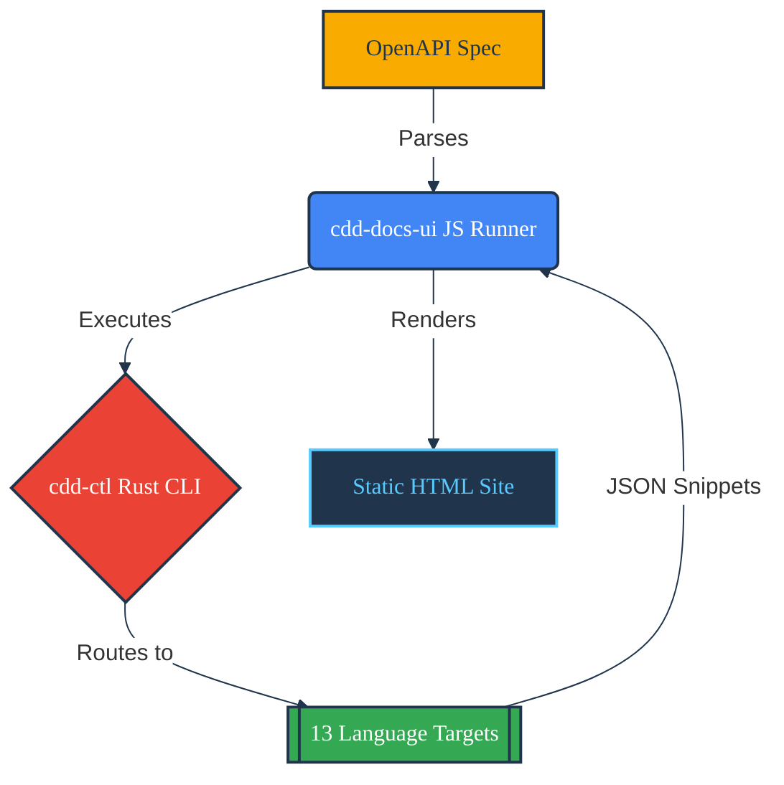

# CDD Docs UI

 

[](https://github.com/SamuelMarks/cdd-docs-ui/actions/workflows/ci.yml)

A strictly-typed TypeScript CLI tool for generating static, progressively-enhanced API documentation websites based on OpenAPI specifications and code snippets from the `cdd` (Compiler Driven Development) toolchain.

## Architecture Diagram



## Features

- **100% Test Coverage:** Rigorously tested core logic.
- **Strict TypeScript:** No `any` or `unknown` types.
- **Progressive Enhancement:** Generates pure static HTML for fast load times and SEO. Enhances with Vanilla JS for dynamic, no-reload language switching.
- **Variant Support:** Supports and dynamically renders snippets with or without imports and code-wrapping.
- **Material 3 Theming:** Responsive, modern design out of the box.

## Architecture & Development

For detailed information on how the tool is structured, how to develop locally, and compliance standards, refer to the following guides:

- [ARCHITECTURE.md](ARCHITECTURE.md): An overview of the SSG process and component architecture.
- [COMPLIANCE.md](COMPLIANCE.md): Standards for TypeScript strictness, test coverage, and security.
- [DEVELOPING.md](DEVELOPING.md): Instructions on how to build, test, and contribute.
- [USAGE.md](USAGE.md): Detailed CLI options and usage instructions.

## Installation

To run from source:

```bash
npm install
npm run build
```

To install globally:

```bash
npm install -g .
```

## Quick Start Example

This repository includes a sample Petstore `spec.json`.

1. **Generate the Example:**

```bash
npm start
```

_Note: If you don't have the underlying `cdd-ctl` binary installed globally, the tool will gracefully output mocked fallback text for the UI so you can still test the layout and functionality._

2. **Serve the Example:**

```bash
npm run serve
```

Navigate to `http://localhost:8000` to view the generated documentation and test the interactive language dropdown and formatting checkboxes.
